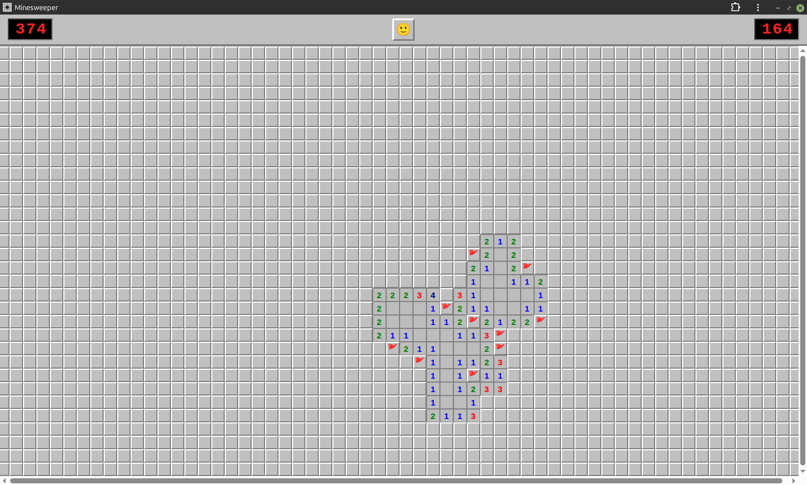

# Minesweeper

Classic Minesweeper in a single HTML file. No build step, no dependencies, no backend —
open `index.html` and play.

The board sizes itself to fill your screen instead of offering fixed difficulty levels:
it fits as many 24px cells as the viewport allows and mines 20% of them. A phone gets a
tall narrow grid, a desktop a wide one.



## Features

- **Auto-sizing board** — fills the viewport, recalculated on resize (only while the current game is untouched)
- **First click is always safe** — mines are placed after the first reveal, never on it or its neighbours
- **Chording** — middle-click or both buttons on a revealed number to open its neighbours once enough flags are set
- **Touch support** — a 🚩 toggle appears on touch devices to switch between revealing and flagging
- **Resume after reload** — the game in progress is kept in `localStorage`
- **Works offline** — the service worker caches the app shell, so it keeps running with no connection
- **Installable** — ships a web app manifest, so it can be added to a home screen
- **Windows 95 look** — the bevels are plain CSS borders, the digit colours are the original palette

## Controls

| Action | Mouse | Touch |
|---|---|---|
| Reveal a cell | Left click | Tap |
| Toggle a flag | Right click | Tap with 🚩 mode on |
| Chord | Middle click, or both buttons | — |
| New game | Click the smiley | Tap the smiley |

## Running it

Any static file server works. The service worker needs an `http://` or `https://` origin,
so opening the file over `file://` works for the game itself but skips installability.

```sh
python3 -m http.server 8000
# then open http://localhost:8000
```

To deploy, copy the files to any static host — a GitHub Pages branch, an nginx root, an
S3 bucket. All paths are relative, so serving from a subdirectory works too.

## Files

```
index.html      the whole game — markup, styles and logic
manifest.json   web app manifest
sw.js           service worker
icon-192.png    app icon, small
icon-512.png    app icon, large
```

The service worker precaches those files on install and then serves them
stale-while-revalidate: a load is answered from the cache and the entry is
refreshed in the background, so the game starts instantly and works offline,
and a new deployment is picked up on the load after next.

## License

MIT — see [LICENSE](LICENSE).
